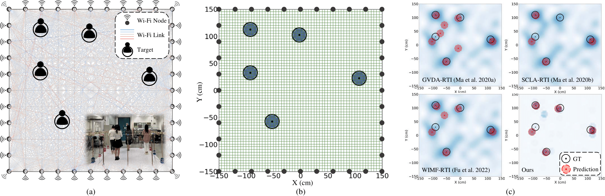

## Multitarget Device-Free Localization with Wi-Fi RSS



This repo is the official implementation of 
**"[Multitarget Device-Free Localization via Cross-Domain Wi-Fi RSS Training Data and Attentional Prior Fusion](https://ojs.aaai.org/index.php/AAAI/article/view/27759)"** (AAAI, 2024)<br>
Na Fan, Zeyue Tian, Amartansh Dubey, Samruddhi Deshmukh, Ross Murch, Qifeng Chen<br>

Abstract: *Device-free localization (DFL) using easily-obtained Wi-Fi received signal strength (RSS) has wide real-world applications for not requiring people to carry trackable devices.
However, accurate multitarget DFL remains challenging due to the unknown number of targets, multipath interference (MPI), especially between nearby targets, and limited real-world data. 
In this study, we pioneeringly propose a transformer-based learning method with Wi-Fi RSS as input, and an attentional prior fusion module, to simultaneously locate an unknown number of people at random positions. 
To overcome the multitarget data collection challenges, we contribute a large-scale cross-domain real-simulation-augmentation training dataset with one and two real-world nearby non-person objects at limited positions and up to five simulated and augmented randomly distributed targets.
Experimental results demonstrate our method's improved accuracy, generalization ability, and robustness with fewer Wi-Fi nodes than previous methods.*

## Release ToDo List
We are still working on the release of the code. Currently, you can have a try at the demo of a few sample data and check the results. 
- [ ] Complete Dataset Release & Introduction
- [ ] Test Code & Evaluation
- [ ] Training Code
<!-- - [ ] Ablation Code? -->
<!-- - [ ] Hardware & Preprocessing Code? -->

## Environment Setup
- This code has been tested on Ubuntu18.04. 

- Install `CUDA v10.2` with `cudnn v7` following
  the [official installation instructions](https://docs.nvidia.com/cuda/cuda-installation-guide-linux/index.html)

- Create Anaconda Environment:
  ```bash
  conda create -n RSSDFL python=3.7 ipykernel
  conda activate RSSDFL
  python -m ipykernel install --user --name RSSDFL --display-name "RSSDFL"
  ```

- Install `PyTorch>=1.8.0` and `torchvision>=0.9.0` for `CUDA v10.2`:
  ```bash
  conda install pytorch==1.8.0 torchvision==0.9.0 cudatoolkit=10.2 -c pytorch
  ```

- Install other requirements:
  ```bash
  pip install -r requirements.txt
  ```

## Dataset
Complete dataset to be released...

## Pretrained Weights
Please download the pretrained checkpoint [demo_ckpt.pth(121.1MB)](https://hkustconnect-my.sharepoint.com/:u:/g/personal/nfanaa_connect_ust_hk/ETxsj4MLGt9FvaL8bkem04MB7fnP2WsBrbeMA1EYN7Dyrw?e=WKoy19) and put it into the directory ckpt/. 

## Demo
Run [demo.ipynb](https://github.com/FionaFN/MultiTarget_WiFi_DFL/blob/main/demo.ipynb)

## Test
Code to be released...

## Training
Code to be released...

## Citation
If you find our work useful in your research, please consider citing our paper:

```
@inproceedings{RSSDFL,
  title        = {Multitarget Device-Free Localization via Cross-Domain Wi-Fi {RSS} Training Data and Attentional Prior Fusion},
  author       = {Na Fan and Zeyue Tian and Amartansh Dubey and Samruddhi Deshmukh and Ross D. Murch and Qifeng Chen},                  
  booktitle    = {AAAI},
  pages        = {91--99},
  year         = {2024},
}
```
